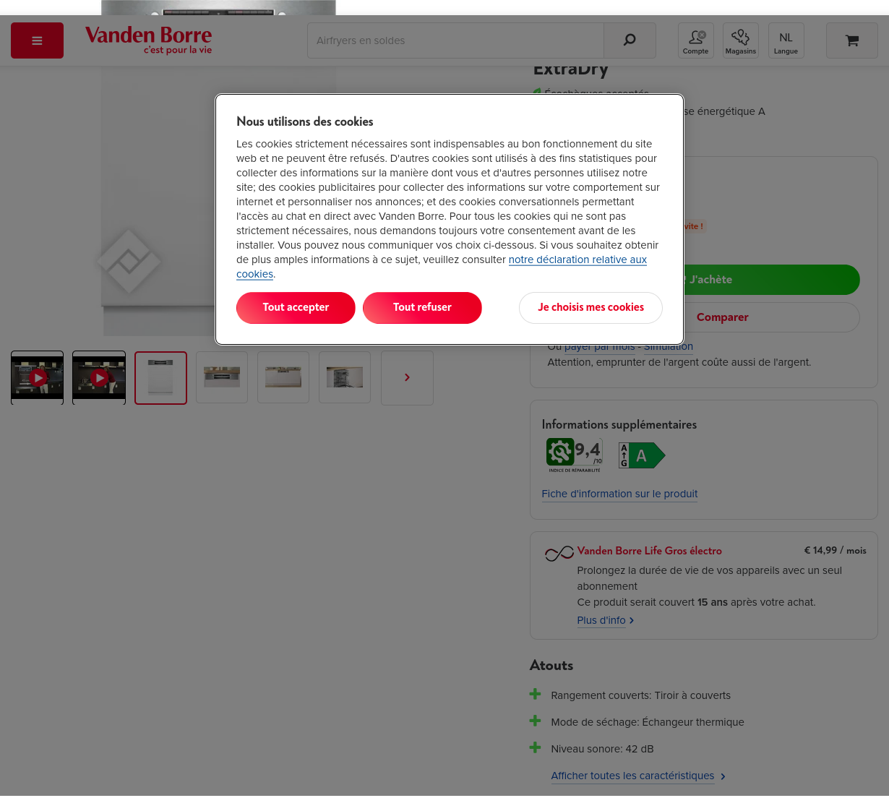

Livré demain \- Voir le stock

€ 699,00

Moins de 10 en stock, commandez vite !

Action encastrable

[Action encastrable](//www.vandenborre.be/fr/lave-vaisselle-encastrable/bosch-smi4ecs28e-serie-4-extradry)

Action encastrable

J'achète

Comparer

Ou payer par mois \- [Simulation](https://www.buyway.be/simu/vdb/fr)

Attention, emprunter de l'argent coûte aussi de l'argent.

### Informations supplémentaires

9,4

[Fiche d'information sur le produit](https://eprel.ec.europa.eu/api/product/1956200/fiches?noRedirect=false&language=FR)

Vanden Borre Life Gros électro

€ 14,99 / mois

Prolongez la durée de vie de vos appareils avec un seul abonnement

Ce produit serait couvert **15 ans** après votre achat.

Plus d'info

Atouts
------

* ### Rangement couverts: Tiroir à couverts
    
* ### Mode de séchage: Échangeur thermique
    
* ### Niveau sonore: 42 dB
    
* Afficher toutes les caractéristiques

[Source](https://www.vandenborre.be/fr/lave-vaisselle-encastrable/bosch-smi4ecs28e-serie-4-extradry)