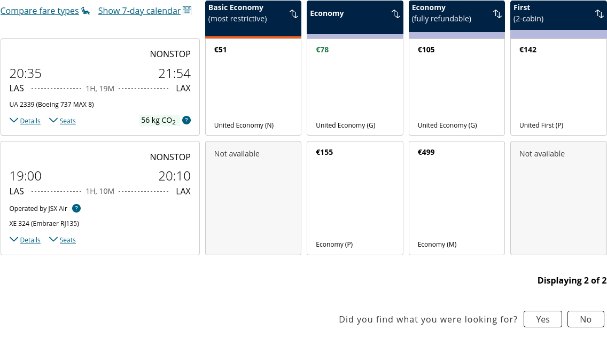

Flight Information

NONSTOP

20:35Departing at 20:35

21:54Arriving at 21:54

LASOrigin Las Vegas, NV, US (LAS)

1H, 19MDuration 1 hours and 19 minutes

LAXDestination Los Angeles, CA, US (LAX)

UA 2339 (Boeing 737 MAX 8)Flight Number UA 2339. Aircraft Boeing 737 MAX 8

DetailsSeats

56 kg CO2Carbon emissions estimate: 56 kilograms. This is a lower emissions flight.

Learn more about carbon emissions

Economy

€86

United Economy (K)

Add to cart

Select fare for Economy

€86

Economy

€86

United Economy (K)

Add to cart

Select fare for Economy

€86

Flight Information

NONSTOP

19:00Departing at 19:00

20:10Arriving at 20:10

LASOrigin Las Vegas, NV, US (LAS)

1H, 10MDuration 1 hours and 10 minutes

LAXDestination Los Angeles, CA, US (LAX)

Operated by JSX Air

JSX Tooltip. Select this button to trigger the tooltip button.

XE 324 (Embraer RJ135)Flight Number XE 324. Aircraft Embraer RJ135

DetailsSeats

Economy

€155

Economy (P)

Add to cart

Select fare for Economy

€155

Economy

€155

Economy (P)

Add to cart

Select fare for Economy

€155

