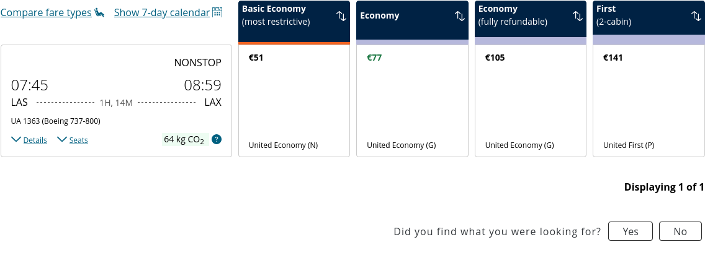

Flight Information

NONSTOP

06:30Departing at 06:30

07:04Arriving at 07:04

PHXOrigin Phoenix, AZ, US (PHX)

1H, 34MDuration 1 hours and 34 minutes

LAXDestination Los Angeles, CA, US (LAX)

UA 1395 (Boeing 737-900)Flight Number UA 1395. Aircraft Boeing 737-900

DetailsSeats

76 kg CO2Carbon emissions estimate: 76 kilograms. This is a lower emissions flight.

Learn more about carbon emissions

Economy

€101

United Economy (K)

Add to cart

Select fare for Economy

€101

Economy

€101

United Economy (K)

Add to cart

Select fare for Economy

€101

