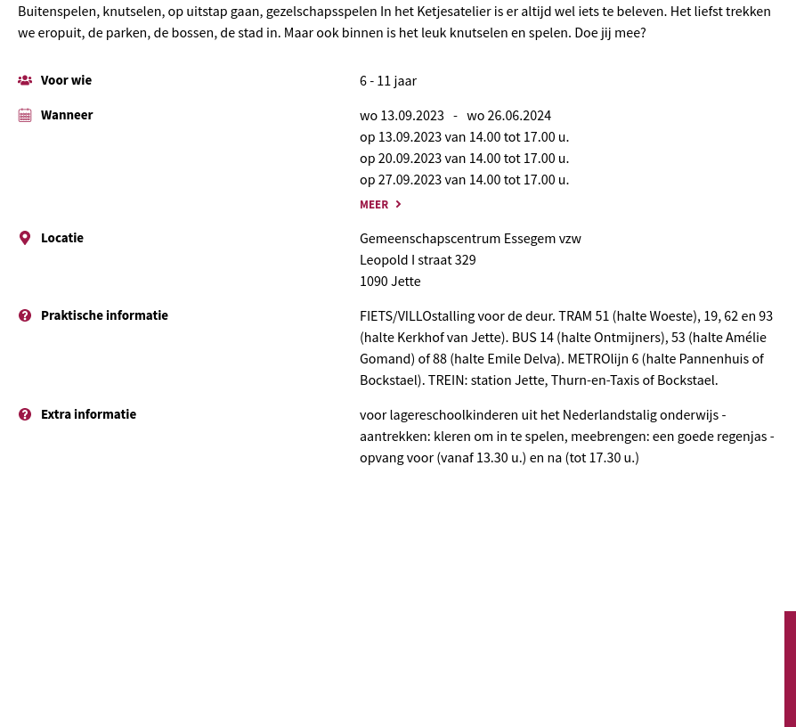

Buitenspelen, knutselen, op uitstap gaan, gezelschapsspelen In het Ketjesatelier is er altijd wel iets te beleven. Het liefst trekken we eropuit, de parken, de bossen, de stad in. Maar ook binnen is het leuk knutselen en spelen. Doe jij mee?

Voor wie

6

 - 11 jaar

Wanneer

wo 13.09.2023 \- wo 26.06.2024

op 13.09.2023 van 14.00 tot 17.00 u.  
op 20.09.2023 van 14.00 tot 17.00 u.  
op 27.09.2023 van 14.00 tot 17.00 u.  
op 4.10.2023 van 14.00 tot 17.00 u.  
op 11.10.2023 van 14.00 tot 17.00 u.  
op 18.10.2023 van 14.00 tot 17.00 u.  
op 25.10.2023 van 14.00 tot 17.00 u.  
op 8.11.2023 van 14.00 tot 17.00 u.  
op 15.11.2023 van 14.00 tot 17.00 u.  
op 22.11.2023 van 14.00 tot 17.00 u.  
op 29.11.2023 van 14.00 tot 17.00 u.  
op 6.12.2023 van 14.00 tot 17.00 u.  
op 13.12.2023 van 14.00 tot 17.00 u.  
op 20.12.2023 van 14.00 tot 17.00 u.  
op 10.01.2024 van 14.00 tot 17.00 u.  
op 17.01.2024 van 14.00 tot 17.00 u.  
op 24.01.2024 van 14.00 tot 17.00 u.  
op 31.01.2024 van 14.00 tot 17.00 u.  
op 7.02.2024 van 14.00 tot 17.00 u.  
op 21.02.2024 van 14.00 tot 17.00 u.  
op 28.02.2024 van 14.00 tot 17.00 u.  
op 6.03.2024 van 14.00 tot 17.00 u.  
op 13.03.2024 van 14.00 tot 17.00 u.  
op 20.03.2024 van 14.00 tot 17.00 u.  
op 27.03.2024 van 14.00 tot 17.00 u.  
op 17.04.2024 van 14.00 tot 17.00 u.  
op 24.04.2024 van 14.00 tot 17.00 u.  
op 8.05.2024 van 14.00 tot 17.00 u.  
op 15.05.2024 van 14.00 tot 17.00 u.  
op 22.05.2024 van 14.00 tot 17.00 u.  
op 29.05.2024 van 14.00 tot 17.00 u.  
op 5.06.2024 van 14.00 tot 17.00 u.  
op 12.06.2024 van 14.00 tot 17.00 u.  
op 19.06.2024 van 14.00 tot 17.00 u.  
op 26.06.2024 van 14.00 tot 17.00 u.  

MeerMeer over Ketjesatelier

Locatie

Gemeenschapscentrum Essegem vzw  
Leopold I straat 329  
1090 Jette

Praktische informatie

FIETS/VILLOstalling voor de deur. TRAM 51 (halte Woeste), 19, 62 en 93 (halte Kerkhof van Jette). BUS 14 (halte Ontmijners), 53 (halte Amélie Gomand) of 88 (halte Emile Delva). METROlijn 6 (halte Pannenhuis of Bockstael). TREIN: station Jette, Thurn-en-Taxis of Bockstael.

Extra informatie

voor lagereschoolkinderen uit het Nederlandstalig onderwijs - aantrekken: kleren om in te spelen, meebrengen: een goede regenjas - opvang voor (vanaf 13.30 u.) en na (tot 17.30 u.)

© Usman Khalid

[Source](https://www.essegem.be/activiteiten/ketjesatelier-0)